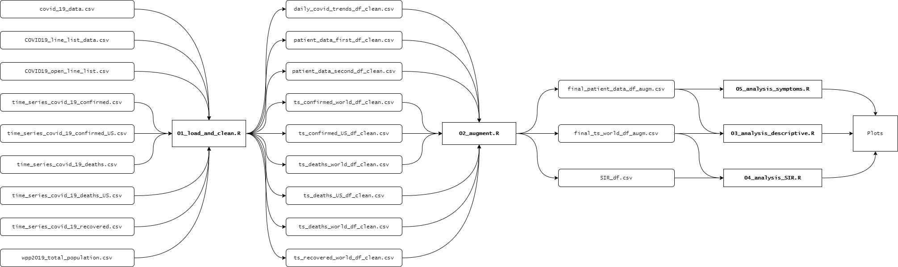

# 2020_group06: COVID-19 analysis and modelling

## Group
Sule Altintas, Sebastian Sbirna and Stanley Frederiksen

## Description

This project serves as a repository for the final project organization and version control requirements of the course 22100 (DTU).

Our project is based on the analysis of a data set containing daily numbers of confirmed cases, deaths, and recoveries from the whole world, as well as patient data including symptoms. The fully wrangled data can be found under data/_augmented.

## Data

The raw data was obtained from Kaggle:

https://www.kaggle.com/sudalairajkumar/novel-corona-virus-2019-dataset

and augmented with world population data from the UN:

https://population.un.org/wpp/Download/Standard/CSV/

## Dependencies
The following dependencies are necessary to run our project:
- [R](https://cran.r-project.org/bin/windows/base/) >= 4.0.0, and the following additional packages:
  * __tidyverse__
  * __lubridate__
  * __broom__
  * __leaflet__
  * __leaflet.extras__
  * __ggpubr__
  * __rpart__
  * __rpart.plot__
  * __factoextra__
  * __caret__
  * __gridExtra__
  * __deSolve__

## Usage
By running the script R/00_do.R, the full data analysis can be carried out. This is especially useful if updating the data in data/_raw with the new daily numbers, as new data will be incorporated into all resulting plots.
