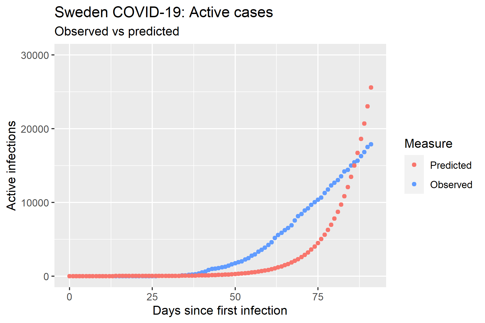
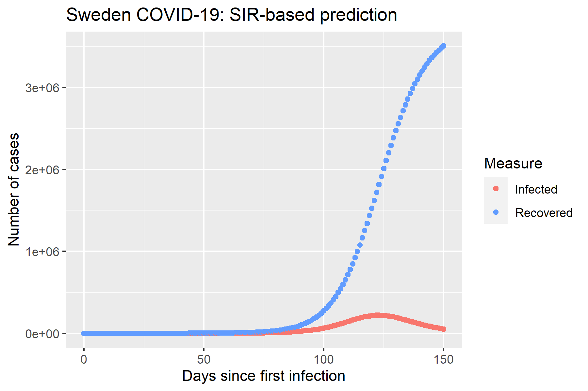

```{r setup, include=FALSE}
knitr::opts_chunk$set(echo = FALSE)
library("imager")
library("cowplot")
library("magick")
library("tidyverse")
library("imager")
```

## Github repository

<https://github.com/rforbiodatascience/2020_group06>

## Introduction
### The dataset
<br>
Our project has used a modified version of this data, which is available from Kaggle: <https://www.kaggle.com/sudalairajkumar/novel-corona-virus-2019-dataset>, by _Sudalai Rajkumar_, which consists of:

* patient data from the first 2 months of the outbreak 
* time-series data about the spread of the virus

Please note that infection spreading information and data regarding COVID19 is being updated every day. The data used for this project was first pulled on 15 April 2020, and has been updated accordingly since then. 

*__The last update of the data was done on 1 May 2020.__*


## Heatmap of confirmed cases

Status of the COVID-19 confirmed cases in the world

- Observed from January-February 2020

```{r fig.align="center"}

heatmap_confirmed <- load.image("../results/03_heatmap_confirmed.png")

ggdraw() +
  draw_image(heatmap_confirmed, scale = 1,
  clip = "on")

# clip = "on", is a funcition that draws the image into the "container/box" generated by ggdraw.

```

# Methods

## Methodology
### Data Import

* This modified version of the JHU dataset initially contained 9 "untidy" dataframes:
  * `covid_19_data.csv`: daily information on confirmed, recovered and deceased patients
  * `COVID19_line_list_data.csv`: first patient data file, with ~1000 records
  * `COVID19_open_line_list.csv`: second patient data file, with ~10000 records
  * `time_series_covid_19_confirmed.csv`: daily number of confirmed cases around the world 
  * `time_series_covid_19_confirmed_US.csv`: daily number of confirmed cases only for US and its states
  
## Methodology
### Data Import
* This modified version of the JHU dataset initially contained 9 "untidy" dataframes:
  * `time_series_covid_19_deaths.csv`: daily number of deceased cases around the world
  * `time_series_covid_19_deaths_US.csv`: daily number of deceased cases only for US and its states
  * `time_series_covid_19_recovered.csv`: daily number of recovered cases around the world
  * `wpp2019_total_population.csv`: data downloaded from <https://population.un.org/wpp/Download/Standard/CSV/> which has the total population of a country in 2019
  

## Methodology
### Data Wrangling

* All these dataframes were very messy
  * Different number and type of attributes
  * Different formats for storing country & provinces
  * Different methodology of collecting time-series data
  * Empty and extremely sparse columns
  * Conceptual string duplicates (e.g. _runny nose_ and _nasal discharge_ )
  * ... and more
  

## Methodology
### _How did we achieve data wrangling?_
* Very heavy use of `stringr` and __`regexp (regular expressions)`__
* `dplyr` to the rescue - filtering, mutating, grouping, summarizing
* `tidyr` for reshaping tibbles into __wide/long format__
* `lubridate` for __dates conversion__
* `readr` for reading and saving CSV files easily
* Achieved a consistent andn easy-to-understand workflow through _piping_ (`%>%`)


  
## Methodology
### _How did we achieve data augmentation?_
* Heavy use of `dplyr` for joining dataframes, mutating and filtering
* `tidyr` for reshaping tibbles into __wide/long format__
* `forcats` for ordering categorical variables
* `readr` for reading and saving CSV files easily


## Fitting beta and gamma to the data
How to find the optimal values of $\beta$ and $\gamma$?

One answer: Minimize the residual square error (RSS) between the observed number of infections and the predicted.

For this, we need:

- A way to solve the ODEs: function ode() from R package deSolve
- An optimizer: built-in R function optimize()


# Exploratory data analysis


## Biological insights

- How does the COVID-19 affect each gender?

- Which symptoms are we likely to observe among the patients?

- Can we predict the patient's progression?


## Data distribution among age and gender

- Mostly male patients are affected
- Most occuring ages among the affected are between 30-59 years old

```{r fig.align="center"}

distribution_age_group_gender <- load.image("../results/03_distribution_age_group_gender.png")

ggdraw() +
  draw_image(distribution_age_group_gender, scale = 1,
  clip = "on")

```


## Prevalence of symptoms

- fever, cough and sore throat are the most frequent symptoms observed among the patients

```{r fig.align="center"}

Prevalence_symptoms <- load.image("../results/03_prevalence_symptoms.png")

ggdraw() +
  draw_image(Prevalence_symptoms, scale = 1,
  clip = "on")

```


## Symptoms, dead vs. recovered patients

- Fever was most prevalent among the recovered but cough was more represented among the dead patients

```{r fig.align="center"}

symptoms_dead_or_recovered <- load.image("../results/05_symptoms_dead_or_recovered.png")

ggdraw() +
  draw_image(symptoms_dead_or_recovered, scale = 0.9,
  clip = "on")

```


## Symptoms in selected asian countries

- Other symptoms (fatigue, sore throat, headache etc.) was more frequently observed in Japan compared to other countries. South Korea observed only fever

```{r fig.align="center"}

symptoms_per_country <- load.image("../results/05_symptoms_per_country.png")

ggdraw() +
  draw_image(symptoms_per_country, scale = 0.9,
  clip = "on")

```


## Propotion of symptoms by gender

- Muscle pain, joint pain and diarrhea were only observed among the male patients

```{r fig.align="center"}

symptoms_per_gender <- load.image("../results/05_symptoms_per_gender.png")

ggdraw() +
  draw_image(symptoms_per_gender, scale = 1,
  clip = "on")

```


## Time to admission

- The time from experiencing symptoms to hospitalization does not tend to differ whether the patient have been in contact with Wuhan or not.

```{r fig.align="center"}

onset_to_admission <- load.image("../results/03_onset_to_admission.png")

ggdraw() +
  draw_image(onset_to_admission, scale = 1,
  clip = "on")

```


## Total confirmed cases per million population

- Sweden have most confirmed cases and Philippines have the least cases

```{r fig.align="center"}

confirmed_per_mill <- load.image("../results/03_confirmed_per_mill.png")

ggdraw() +
  draw_image(confirmed_per_mill, scale = 1,
  clip = "on")
  

```


## Total death cases per million population

- Romania and Turkey have approx. the same counts of deaths per million population

```{r fig.align="center"}

deaths_per_mill <- load.image("../results/03_deaths_per_mill.png")

ggdraw() +
  draw_image(deaths_per_mill, scale = 1,
  clip = "on")

```


# Linear Models

## Linear regression model of the 5 countries (confirmed cases)

- All coefficients are significant

```{r fig.align="center"}

table_df_ts_models_stats <- load.image("../results/03_table_df_ts_models_stats.png")

ggdraw() +
  draw_image(table_df_ts_models_stats, scale = 1,
  clip = "on")

```


## Model evaluation of the confirmed cases

- Sweden with the highest rate of confirmed cases

```{r fig.align="center"}

model_eval_confirmed <- load.image("../results/03_model_eval_confirmed.png")

ggdraw() +
  draw_image(model_eval_confirmed, scale = 1,
  clip = "on")

```


## Model evaluation of the death cases

- Sweden have almost 3 times higher death rate compared to Denmark

```{r fig.align="center"}

model_eval_death <- load.image("../results/03_model_eval_death.png")

ggdraw() +
  draw_image(model_eval_death, scale = 1,
  clip = "on")

```


## Model evaluation: Residuals

- The model residuals for the death cases have approx. zero mean and constant variance, which is not the case for the confirmed cases.

```{r fig.align="center"}

model_eval_residuals <- load.image("../results/03_model_eval_residuals.png")

ggdraw() +
  draw_image(model_eval_residuals, scale = 1,
  clip = "on")

```

# SIR models

## Modelling the COVID-19 pandemic: SIR

```{r,  out.width =  "800px", fig.align = 'center'}

```
$$\frac{dS}{dt} = \beta\cdot S\cdot I $$
$$\frac{dS}{dt} = \beta\cdot S\cdot I $$

$$\frac{dR}{dt} = \gamma \cdot I $$

## Observed cases in Denmark
```{r,  out.width =  "700", fig.align = 'center'}
knitr::include_graphics("../results/04_Denmark_obs.png")
```


## Resulting parameters: Sweden

Optimized values were found to $\beta = 0.56$ and $\gamma = 0.44$

giving a reproductive rate of $R_0 = 1.25$

```{r,  out.width =  "580px", fig.align = 'center'}

```

## Making predictions

```{r,  out.width =  "700", fig.align = 'center'}

```

# Shiny app demonstration of the epidemical model

<https://sule-altintas.shinyapps.io/SIR_app/>


# Dimensional reduction and Machine Learning

## PCA

- The first three PCs account for ~60% of the total variance
- Biological features: symptoms, age, gender, contact with wuhan

```{r fig.align="center"}

pca_biological_features <- load.image("../results/03_pca_biological_features.png")

ggdraw() +
  draw_image(pca_biological_features, scale = 1,
  clip = "on")

```


## Predicting patient progression

- Training and test set (80/20), plot performed on the training set
- If you have been in contact with Wuhan and your age is equal to or above 73 years old, the probability of being dead is 92%

```{r fig.align="center"}

df_patient_dec_fit <- load.image("../results/03_df_patient_dec_fit.png")

ggdraw() +
  draw_image(df_patient_dec_fit, scale = 1,
  clip = "on")

```


## Evaluation of the decision tree

- Rows are the true classes and the columns are the predicted classes
- Accuracy = 97.6%

```{r fig.align="center"}

table_cm_plot <- load.image("../results/03_table_cm_plot.png")

ggdraw() +
  draw_image(table_cm_plot, scale = 1,
  clip = "on")

```


# Discussion and challenges

## Discussion

- Males are overrepresented among the patients
- Symptoms caused by COVID-19 resemble influenza (fever, cough, sore throath etc.)
- Death is merely due to age, while recovery may depend on experienced symptoms
- Community/political actions can have an affect on infection, which can be seen between Denmark and Sweden (two comparable nations)
- Linear model may not be appropriate for the confirmed cases but works well for the death cases.
- The SIR-modelling may be too simple, an extension may be required
- Decision tree is suitable and interpretable for predicting patient progression

## Challenges

- We were not able to find a suitable function to save the plots of the heatmap and decision tree. This was done manually by export
- Multiple errors occured when using github, reverting was necessary a couple of times

# Questions?